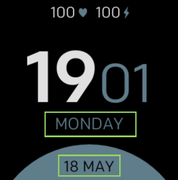

# Minimal Design

**Available only for Fitbit Versa, Versa Lite, Versa 2**

Minimal clock with support for:
- 24/12h formats
- Custom date formats
- All languages supported
- 3 different color configurations
- Battery percentage (optional)

## Translated documentation
- [:de: German](./docs/de/README.md)
- [:es: Spanish](./docs/es/README.md)
- [:fr: French](./docs/fr/README.md)
- [:it: Italian](./docs/it/README.md)
- [:jp: Japanese](./docs/ja/README.md)
- [:kr: Korean](./docs/ko/README.md)
- [:netherlands: Dutch](./docs/nl/README.md)
- [:sweden: Swedish](./docs/sv/README.md)
- [:cn: Simplified Chinese](./docs/zh/README.md)
- [:cn: Traditional Chinese](./docs/zh-TW/README.md)

## Label mapping

- **Format 1**
- **Format 2**

## List of all available date formats
| Format | Output           | Description                           |
| ------ | ---------------- | ------------------------------------- |
| `YY`   | 18               | Two-digit year                        |
| `YYYY` | 2018             | Four-digit year                       |
| `M`    | 1-12             | The month, beginning at 1             |
| `MM`   | 01-12            | The month, 2-digits                   |
| `MMM`  | Jan-Dec          | The abbreviated month name            |
| `MMMM` | January-December | The full month name                   |
| `D`    | 1-31             | The day of the month                  |
| `DD`   | 01-31            | The day of the month, 2-digits        |
| `d`    | 0-6              | The day of the week, with Sunday as 0 |
| `dd`   | Su-Sa            | The min name of the day of the week   |
| `ddd`  | Sun-Sat          | The short name of the day of the week |
| `dddd` | Sunday-Saturday  | The name of the day of the week       |
| `H`    | 0-23             | The hour                              |
| `HH`   | 00-23            | The hour, 2-digits                    |
| `h`    | 1-12             | The hour, 12-hour clock               |
| `hh`   | 01-12            | The hour, 12-hour clock, 2-digits     |
| `m`    | 0-59             | The minute                            |
| `mm`   | 00-59            | The minute, 2-digits                  |
| `s`    | 0-59             | The second                            |
| `ss`   | 00-59            | The second, 2-digits                  |
| `SSS`  | 000-999          | The millisecond, 3-digits             |
| `Z`    | +05:00           | The offset from UTC                   |
| `ZZ`   | +0500            | The offset from UTC, 2-digits         |
| `A`    | AM PM            |                                       |
| `a`    | am pm            |                                       |