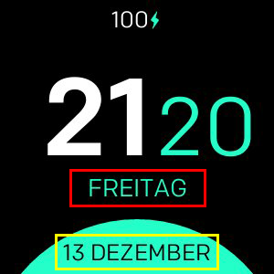

# Minimal Design

**Nur für Fitbit Versa, Versa Lite, Versa 2 verfügbar**

Minimale Uhr mit Unterstützung für:
- 24 / 12h-Formate
- Benutzerdefinierte Datumsformate
- Alle Sprachen werden unterstützt
- 3 verschiedene Farbkonfigurationen
- Batterieprozentsatz (optional)
- Herzfrequenz (optional)

## Label Mapping

- **Format 1 (rot)**
- **Format 2 (gelb)**

## Liste aller verfügbaren Datumsformate
| Format | Ausgabe | Beschreibung |
| ------ | ---------------- | ------------------------------------- |
| `YY` | 18 | Zweistelliges Jahr |
| `YYYY` | 2018 | Vierstellige Jahreszahl |
| `M` | 1-12 | Der Monat, beginnend mit 1 |
| `MM` | 01-12 | Der Monat, zweistellig |
| `MMM` | Jan-Dez | Der abgekürzte Monatsname |
| `MMMM` | Januar-Dezember | Der vollständige Monatsname
| `D` | 1-31 | Der Tag des Monats
| `DD` | 01-31 | Der Tag des Monats, zweistellig |
| `d` | 0-6 | Der Wochentag mit dem Sonntag als 0 |
| `dd` | Su-Sa | Der min. Name des Wochentags |
| `ddd` | So-Sa | Der Kurzname des Wochentags |
| `dddd` | Sonntag-Samstag | Der Name des Wochentags |
| `H` | 0-23 | Die stunde |
| `HH` | 00-23 | Die Stunde, zweistellig |
| `h` | 1-12 | Die Stunde, 12-Stunden-Uhr |
| `hh` | 01-12 | Die Stunde, 12-Stunden-Uhr, zweistellig |
| `m` | 0-59 | Die Minute |
| `mm` | 00-59 | Die Minute, zweistellig |
| `s` | 0-59 | Der zweite |
| `ss` | 00-59 | Die zweite, zweistellige |
| `SSS` | 000-999 | Die Millisekunde, 3-stellig |
| `Z` | +05: 00 | Der Versatz von UTC |
| `ZZ` | +0500 | Der Versatz von UTC, zweistellig |
| `A` | AM PM | |
| `a` | am pm | |

## Credits
Hergestellt mit :heart: von [Nicolò Rebaioli](https://www.rebaioli.altervista.org)