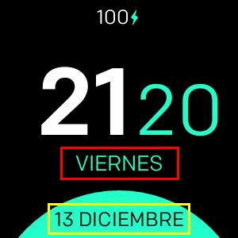

# Minimal Design

**Disponible solo para Fitbit Versa, Versa Lite, Versa 2**

Reloj mínimo con soporte para:
- 24 / 12h formatos
- Formatos de fecha personalizados
- Todos los idiomas soportados
- 3 configuraciones de color diferentes
- Porcentaje de batería (opcional)
- Frecuencia cardíaca (opcional)

## Mapeo de etiquetas

- **Formato 1 (rojo)**
- **Formato 2 (amarillo)**

## Lista de todos los formatos de fecha disponibles
| Formato | Salida | Descripción |
| ------ | ---------------- | ------------------------------------- |
| `YY` | 18 Año de dos dígitos |
| `YYYY` | 2018 | Año de cuatro dígitos |
| `M` | 1-12 | mes, a partir de 1 |
| `MM` | 01-12 | mes, 2 dígitos |
| `MMM` | Ene-dic | nombre abreviado dmes |
| `MMMM` | Enero-diciembre | nombre completo dmes |
| `D` | 1-31 | dia dmes |
| `DD` | 01-31 | día dmes, 2 dígitos |
| `d` | 0-6 | día de la semana, con domingo como 0 |
| `dd` | Su-Sa | nombre mínimo ddía de la semana |
| `ddd` | Dom-sab | nombre corto ddía de la semana |
| `dddd` | Domingo-sábado | nombre ddía de la semana |
| `H` | 0-23 | La hora |
| `HH` | 00-23 | La hora, 2 dígitos |
| `h` | 1-12 | La hora, reloj de 12 horas |
| `hh` | 01-12 | La hora, reloj de 12 horas, 2 dígitos |
| `m` | 0-59 | minuto |
| `mm` | 00-59 | minuto, 2 dígitos |
| `s` | 0-59 | segundo |
| `ss` | 00-59 | segundo, 2 dígitos |
| `SSS` | 000-999 | milisegundo, 3 dígitos |
| `Z` | +05: 00 | desplazamiento de UTC |
| `ZZ` | +0500 | desplazamiento de UTC, 2 dígitos |
| `A` | AM PM | |
| `a` | am pm | |

## Créditos
Hecho con :heart: por [Nicolò Rebaioli](https://www.rebaioli.altervista.org)