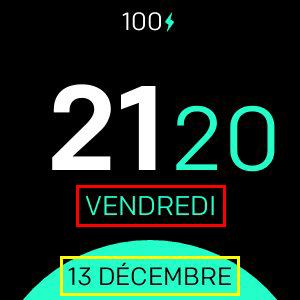

# Minimal Design

**Disponible uniquement pour Fitbit Versa, Versa Lite, Versa 2**

Horloge minimale avec prise en charge de:
- Formats 24 / 12h
- Formats de date personnalisés
- Toutes les langues prises en charge
- 3 configurations de couleurs différentes
- Pourcentage de la batterie (en option)

## Mappage d'étiquettes

-  **Format 1** 
-  **Format 2** 

## Liste de tous les formats de date disponibles
| Format | Sortie | Description |
| ------ | ---------------- | ------------------------------------- |
| `YY` | 18 | Année à deux chiffres |
| `YYYY` | 2018 | Année à quatre chiffres |
| `M` | 1-12 | Le mois, commençant à 1 |
| `MM` | 01-12 | Le mois, 2 chiffres |
| `MMM` | Jan-Dec | Le nom abrégé du mois |
| `MMMM` | Janvier-décembre | Le nom complet du mois |
| `D` | 1-31 | Le jour du mois |
| `DD` | 01-31 | Le jour du mois, à 2 chiffres |
| `d` | 0-6 | Le jour de la semaine, avec dimanche comme 0 |
| `dd` | Su-Sa | Le nom min du jour de la semaine |
| `ddd` | Dim-sam | Le nom court du jour de la semaine |
| `dddd` | Dimanche-samedi | Le nom du jour de la semaine |
| `H` | 0-23 | L'heure |
| `HH` | 00-23 | L'heure, 2 chiffres |
| `h` | 1-12 | L'heure, 12 heures |
| `hh` | 01-12 | L'heure, horloge 12 heures, 2 chiffres |
| `m` | 0-59 | La minute |
| `mm` | 00-59 | La minute, 2 chiffres |
| `s` | 0-59 | Le deuxième |
| `ss` | 00-59 | Le deuxième, à 2 chiffres |
| `SSS` | 000-999 | La milliseconde, 3 chiffres |
| `Z` | +05: 00 | La compensation de l'UTC |
| `ZZ` | +0500 | Le décalage par rapport à l'UTC, à 2 chiffres |
| `A` | AM PM | |
| `a` | am pm | |