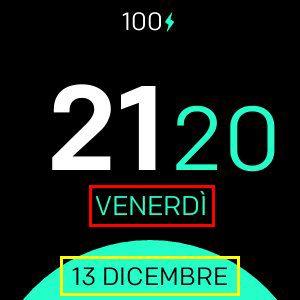

# Minimal Design

**Disponibile solo per Fitbit Versa, Versa Lite, Versa 2**

Orologio minimo con supporto per:
- Formati 24 / 12h
- Formati di data personalizzati
- Tutte le lingue supportate
- 3 diverse configurazioni di colore
- Percentuale della batteria (opzionale)
- Battito cardiaco (opzionale)

## Mappatura etichette

- **Formato 1 (rosso)**
- **Formato 2 (giallo)**

## Elenco di tutti i formati di data disponibili
| Formato | Uscita | Descrizione |
| ------ | ---------------- | ------------------------------------- |
| `YY` | 18 | Anno a due cifre |
| `YYYY` | 2018 | Anno a quattro cifre |
| `M` | 1-12 | Il mese, a partire da 1 |
| `MM` | 01-12 | Il mese, a 2 cifre |
| `MMM` | Gennaio-dicembre | Il nome del mese abbreviato |
| `MMMM` | Gennaio-dicembre | Il nome completo del mese |
| `D` | 1-31 | Il giorno del mese |
| `DD` | 01-31 | Il giorno del mese, a 2 cifre |
| `d` | 0-6 | Il giorno della settimana, con domenica come 0 |
| `dd` | Su-Sa | Il nome minimo del giorno della settimana |
| `ddd` | Dom-sab | Il nome breve del giorno della settimana |
| `dddd` | Domenica-sabato | Il nome del giorno della settimana |
| `H` | 0-23 | L'ora |
| `HH` | 00-23 | L'ora, a 2 cifre |
| `h` | 1-12 | L'ora, orologio a 12 ore |
| `hh` | 01-12 | L'ora, 12 ore, 2 cifre |
| `m` | 0-59 | Il minuto |
| `mm` | 00-59 | Il minuto, a 2 cifre |
| `s` | 0-59 | Il secondo |
| `ss` | 00-59 | La seconda, a 2 cifre |
| `SSS` | 000-999 | Il millisecondo, 3 cifre |
| `Z` | +05: 00 | L'offset da UTC |
| `ZZ` | +0500 | L'offset da UTC, a 2 cifre |
| `A` | AM PM | |
| `a` | pm | |

## Crediti
Realizzato con :heart: da [Nicolò Rebaioli](https://www.rebaioli.altervista.org)