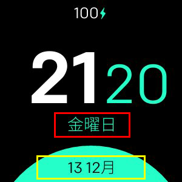

# Minimal Design

**Fitbit Versa、Versa Lite、Versa 2でのみ利用可能**

以下をサポートする最小クロック：
- 24 / 12hフォーマット
- カスタム日付形式
- すべての言語がサポートされています
- 3つの異なるカラー構成
- バッテリーの割合（オプション）
- 心拍数（オプション）

## ラベルマッピング

- **フォーマット1 (赤)**
- **フォーマット2 (黄)**

## 利用可能なすべての日付形式のリスト
|フォーマット|出力|説明|
| ------ | ---------------- | ------------------------------------- |
| `YY` | 18 | 2桁の年|
| `YYYY` | 2018年| 4桁の年|
| `M` | 1-12 | 1から始まる月|
| `MM` | 01-12 |月、2桁|
| `MMM` | 1月〜12月|短縮された月名|
| `MMMM` | 1月〜12月|完全な月名|
| `D` | 1-31 |月の日|
| `DD` | 01-31 |月の日、2桁|
| `d` | 0-6 |日曜日を0とする曜日|
| `dd` |スーサ|曜日の最小名|
| `ddd` |日土|曜日の短い名前|
| `dddd` |日曜日〜土曜日|曜日の名前|
| `H` | 0-23 |時間|
| `HH` | 00-23 |時間、2桁|
| `h` | 1-12 |時、12時間制|
| `hh` | 01-12 |時、12時間制、2桁|
| `m` | 0-59 |分|
| `mm` | 00-59 |分、2桁|
| `s` | 0-59 |第二|
| `ss` | 00-59 | 2番目の2桁|
| `SSS` | 000-999 |ミリ秒、3桁|
| `Z` | +05：00 | UTCからのオフセット|
| `ZZ` | +0500 | UTCからのオフセット、2桁|
| `A` | AM PM | |
| `a` |午前午後| |

## クレジット
Made with :heart：by [Nicolò Rebaioli](https://www.rebaioli.altervista.org)