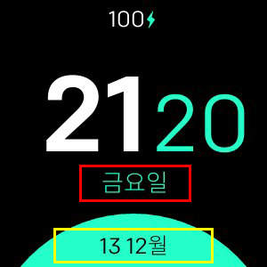

# Minimal Design

**Fitbit Versa, Versa Lite, Versa 2에서만 사용 가능**

다음을 지원하는 최소 시계 :
- 24/12 시간 형식
- 맞춤 날짜 형식
- 모든 언어 지원
- 3 가지 색상 구성
- 배터리 비율 (선택 사항)
- 심박수 (선택 사항)

## 라벨 매핑

- **형식 1 (빨간)**
- **형식 2 (노랑)**

## 사용 가능한 모든 날짜 형식 목록
| 형식 | 출력 | 설명 |
| ------ | ---------------- | ------------------------------------- |
| `YY` | 18 | 두 자리 연도 |
| `YYYY` | 2018 | 네 자리 연도 |
| `M` | 1-12 | 1부터 시작하는 달 |
| `MM` | 01-12 | 월, 두 자리 |
| `MMM` | 1 월-12 월 | 약식 월 이름 |
| `MMMM` | 1 월 -12 월 | 달 이름 전체 |
| `D` | 1-31 | 이 달의 날 |
| `DD` | 01-31 | 월의 일, 두 자리 |
| `d` | 0-6 | 일요일이 0 인 요일 |
| `dd` | 수사 | 요일의 최소 이름 |
| `ddd` | 일요일 토 | 요일의 짧은 이름 |
| `dddd` | 일요일-토요일 | 요일의 이름 |
| `H` | 0-23 | 시간 |
| `HH` | 00-23 | 시간, 두 자리 |
| `h` | 1-12 | 시간, 12 시간제 |
| `hh` | 01-12 | 시간, 12 시간제, 2 자리 |
| `m` | 0-59 | 분 |
| `mm` | 00-59 | 분, 두 자리 |
| `s` | 0-59 | 두 번째 |
| `ss` | 00-59 | 두 번째, 두 자리 |
| `SSS` | 000-999 | 밀리 초, 3 자리 |
| `Z` | +05 : 00 | UTC에서 오프셋 |
| `ZZ` | +0500 | UTC에서 오프셋, 두 자리 |
| `A` | 오전 PM | |
| `a` | 오전 pm | |

## 크레딧
만든 사람 :heart: by [Nicolò Rebaioli](https://www.rebaioli.altervista.org)