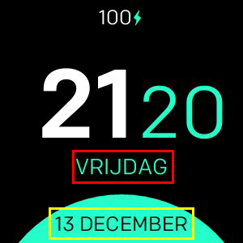

# Minimal Design

**Alleen beschikbaar voor Fitbit Versa, Versa Lite, Versa 2**

Minimale klok met ondersteuning voor:
- 24/12 uur formaten
- Aangepaste datumformaten
- Alle talen ondersteund
- 3 verschillende kleurenconfiguraties
- Batterijpercentage (optioneel)
- Hartslag (optioneel)

## Labelmapping

- **Formaat 1 (rood)**
- **Formaat 2 (geel)**

## Lijst met alle beschikbare datumnotaties
| Formaat | Uitgang | Omschrijving |
| ------ | ---------------- | ------------------------------------- |
| `YY` | 18 | Tweecijferig jaar |
| `YYYY` | 2018 | Viercijferig jaar |
| `M` | 1-12 | De maand, beginnend bij 1 |
| `MM` | 01-12 | De maand, 2 cijfers |
| `MMM` | Jan-dec | De afgekorte maandnaam |
| `MMMM` | Januari-december | De volledige maandnaam |
| `D` | 1-31 | De dag van de maand |
| `DD` | 01-31 | De dag van de maand, 2 cijfers |
| `d` | 0-6 | De dag van de week, met zondag als 0 |
| `dd` | Su-Sa | De min naam van de dag van de week |
| `ddd` | Zon-za | De korte naam van de dag van de week |
| `dddd` | Zondag-zaterdag | De naam van de dag van de week |
| `H` | 0-23 | Het uur |
| `HH` | 00-23 | Het uur, 2 cijfers |
| `h` | 1-12 | Het uur, 12-uurs klok |
| `hh` | 01-12 | Het uur, 12-uurs klok, 2 cijfers |
| `m` | 0-59 | Het moment |
| `mm` | 00-59 | De minuut, 2 cijfers |
| `s` | 0-59 | De tweede |
| `ss` | 00-59 | De tweede, 2 cijfers |
| `SSS` | 000-999 | De milliseconde, 3 cijfers |
| `Z` | +05: 00 | De offset van UTC |
| `ZZ` | +0500 | De offset van UTC, 2 cijfers |
| `A` | AM PM | |
| `a` | am pm | |

## Credits
Gemaakt met :hart: door [Nicolò Rebaioli](https://www.rebaioli.altervista.org)