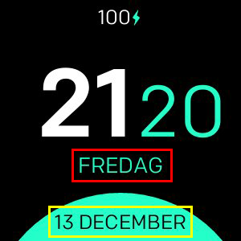

# Minimal Design

**Finns endast för Fitbit Versa, Versa Lite, Versa 2**

Minimal klocka med stöd för:
- 24 / 12h-format
- Anpassade datumformat
- Alla språk stöds
- 3 olika färgkonfigurationer
- Batteriprocent (valfritt)
- Hjärtfrekvens (valfritt)

## Etikettkartläggning

- **Format 1 (röd)**
- **Format 2 (gul)**

## Lista över alla tillgängliga datumformat
| Format | Utgång | Beskrivning |
| ------ | ---------------- | ------------------------------------- |
| `YY` | 18 | Tvåsiffrigt år |
| `YYYY` | 2018 | Fyrsiffrigt år |
| `M` | 1-12 | Månaden som börjar på 1 |
| `MM` | 01-12 | Månaden, 2-siffriga |
| `MMM` | Jan-dec | Den förkortade månadens namn |
| `MMMM` | Januari-december | Namnet på hela månaden |
| `D` | 1-31 | Månadens dag |
| `DD` | 01-31 | Månadens dag, 2-siffriga |
| `d` | 0-6 | Veckodagen, med söndagen som 0 |
| `dd` | Su-Sa | Minnamnet på veckodagen |
| `ddd` | Sol-lör | Det korta namnet på veckodagen |
| `dddd` | Söndag-lördag | Namnet på veckodagen |
| `H` | 0-23 | Timmen |
| `HH` | 00-23 | Timmen, 2-siffriga |
| `h` | 1-12 | Timmen, 12-timmars klockan |
| `hh` | 01-12 | Timmen, 12-timmars klockan, 2-siffror |
| `m` | 0-59 | Minuten |
| `mm` | 00-59 | Minutten, 2-siffriga |
| `s` | 0-59 | Den andra |
| `ss` | 00-59 | Den andra, 2-siffriga |
| `SSS` | 000-999 | Millisekundet, 3-siffror |
| `Z` | +05: 00 | Offset från UTC |
| `ZZ` | +0500 | Offset från UTC, 2-siffror |
| `A` | AM PM | |
| `a` | am pm | |

## Poäng
Tillverkad med :hjärta: av [Nicolò Rebaioli](https://www.rebaioli.altervista.org)