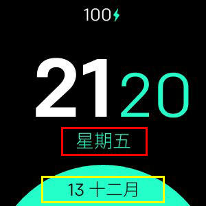

# Minimal Design

**僅適用於Fitbit Versa，Versa Lite，Versa 2**

支持以下功能的最小時鐘：
- 24 / 12h格式
- 自定義日期格式
- 支持所有語言
- 3種不同的顏色配置
- 電池電量百分比（可選）

## 標籤映射

-  **格式1** 
-  **格式2** 

## 所有可用日期格式的列表
|格式|輸出|描述
| ------ | ---------------- | ------------------------------------- |
| `YY` | 18 |兩位數年份|
| `YYYY` | 2018 |四位數年份|
| `M` | 1-12 |從1開始的月份|
| `MM` | 01-12 |月份，兩位數|
| `MMM` | 1月-12月|縮寫的月份名稱|
| `MMMM` |一月至十二月完整的月份名稱|
| `D` | 1-31 |一個月中的一天|
| `DD` | 01-31 |月份中的天，兩位數|
| `d` | 0-6 |星期幾，星期天為0 |
| `dd` | Su-Sa |星期幾的最小名稱|
| `ddd` |週六星期幾的縮寫|
| `dddd` |週日至週六|星期幾的名稱|
| `H` | 0-23 |小時
| `HH` | 00-23 |小時，兩位數|
| `h` | 1-12 |小時，12小時制|
| `hh` | 01-12 |小時，12小時制，2位數字|
| `m` | 0-59 |分鐘
| `mm` | 00-59 |分鐘，兩位數|
| `s` | 0-59 |第二個
| `ss` | 00-59 |第二位，兩位數|
| `SSS` | 000-999 |毫秒，三位數|
| `Z` | +05：00 |與UTC的偏移量|
| `ZZ` | +0500 |與UTC的偏移量，兩位數|
| `A` |上午PM | |
| `a` |下午| |