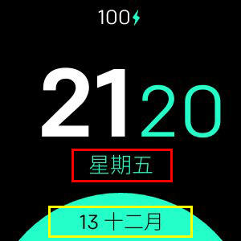

# Minimal Design

**仅适用于Fitbit Versa，Versa Lite，Versa 2**

支持以下功能的最小时钟：
- 24 / 12h格式
- 自定义日期格式
- 支持所有语言
- 3种不同的颜色配置
- 电池电量百分比（可选）
- 心率（可選）

## 标签映射

- **格式1 (紅色)** 
- **格式2 (黃色)** 

## 所有可用日期格式的列表
|格式|输出|描述
| ------ | ---------------- | ------------------------------------- |
| `YY` | 18 |两位数年份|
| `YYYY` | 2018 |四位数年份|
| `M` | 1-12 |从1开始的月份|
| `MM` | 01-12 |月份，两位数|
| `MMM` | 1月-12月|缩写的月份名称|
| `MMMM` |一月至十二月完整的月份名称|
| `D` | 1-31 |一个月中的一天|
| `DD` | 01-31 |月份中的天，两位数|
| `d` | 0-6 |星期几，星期天为0 |
| `dd` | Su-Sa |星期几的最小名称|
| `ddd` |周六星期几的缩写|
| `dddd` |周日至周六|星期几的名称|
| `H` | 0-23 |小时
| `HH` | 00-23 |小时，两位数|
| `h` | 1-12 |小时，12小时制|
| `hh` | 01-12 |小时，12小时制，2位数字|
| `m` | 0-59 |分钟
| `mm` |00-59 |分钟，两位数|
| `s` | 0-59 |第二个
| `ss` | 00-59 |第二位，两位数|
| `SSS` | 000-999 |毫秒，三位数|
| `Z` | +05：00 |与UTC的偏移量|
| `ZZ` | +0500 |与UTC的偏移量，两位数|
| `A` |上午PM | |
| `a` |下午| |

## 学分
制作人 :heart: [Nicolò Rebaioli](https://www.rebaioli.altervista.org)